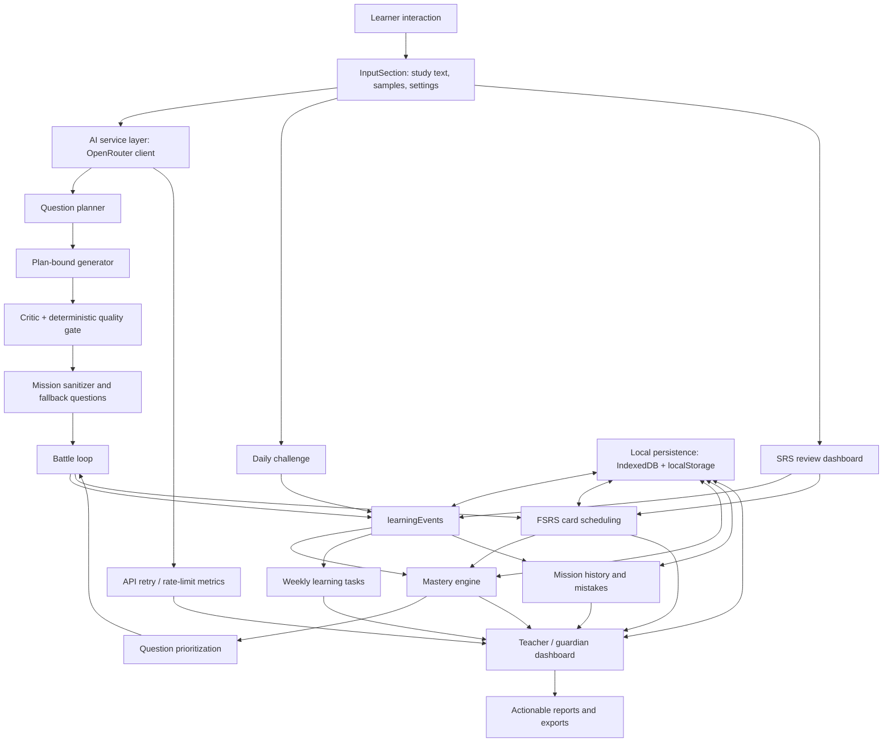
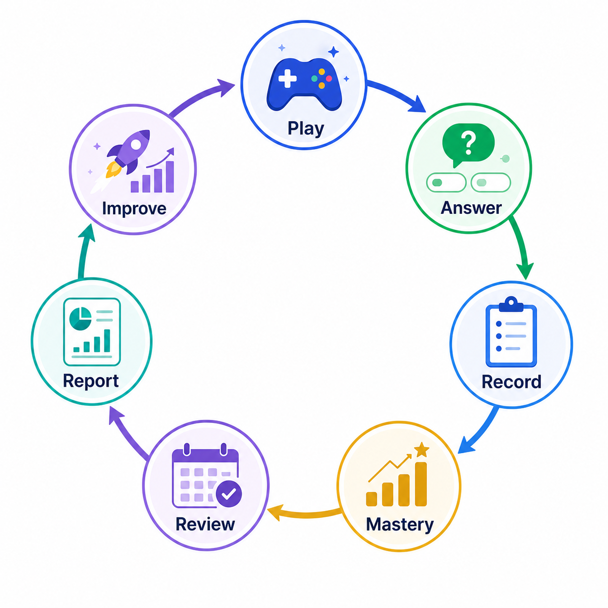
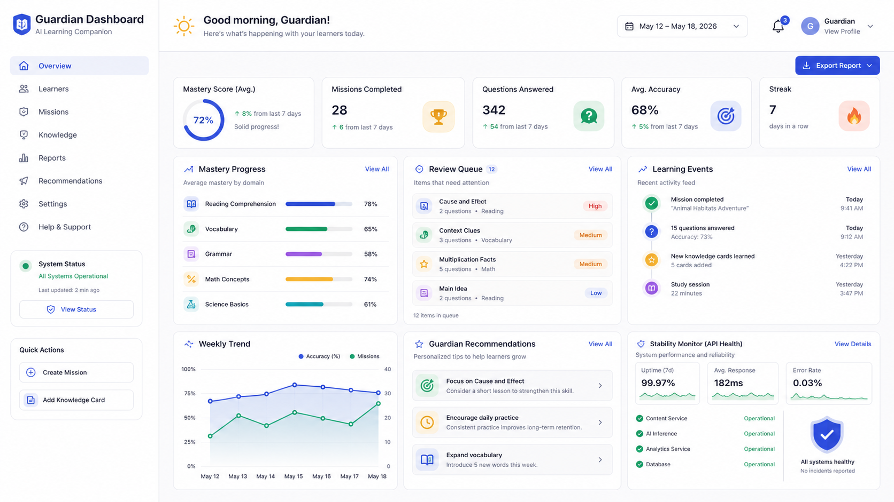
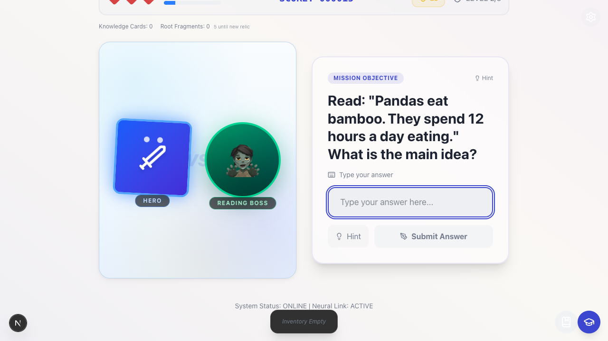
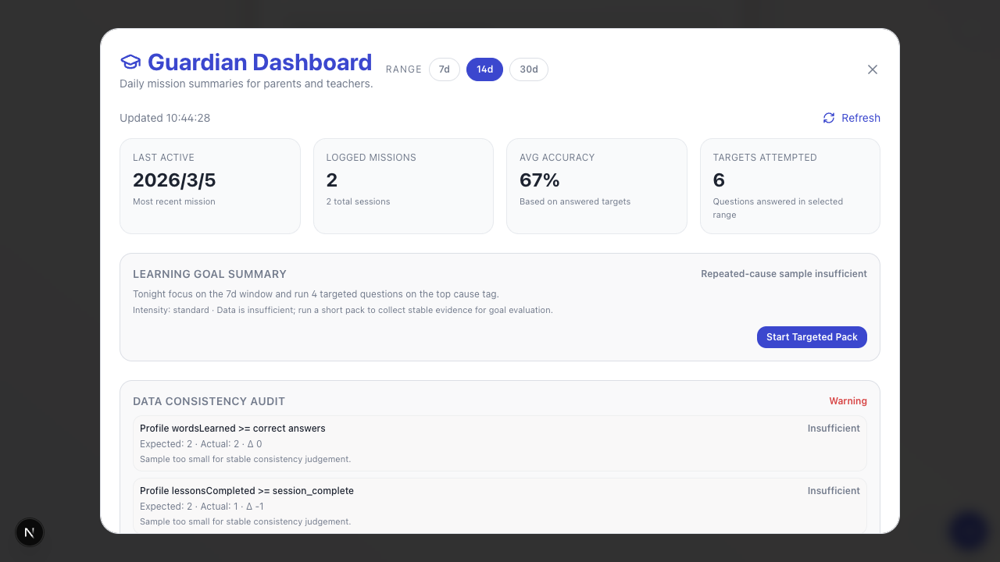
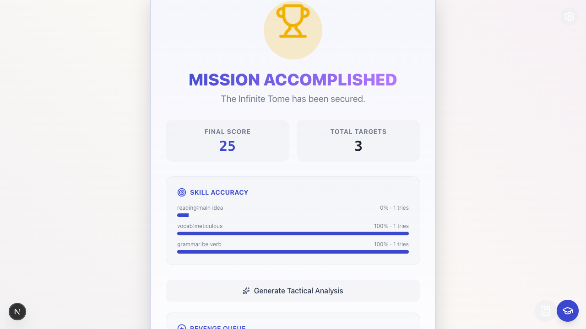

# Word Quest: Infinite Tome

An AI-assisted, game-based vocabulary learning system with SRS, mastery analytics, and teacher/guardian-facing learning evidence.

[](https://github.com/runes780/word-quest-infinite-tome/actions/workflows/ci.yml)
[](https://nextjs.org/)
[](https://react.dev/)
[](https://www.typescriptlang.org/)
[](https://tailwindcss.com/)
[](https://jestjs.io/)
[](LICENSE)


Word Quest: Infinite Tome is an early-stage open-source AI+education project for English vocabulary learning. It explores how vocabulary practice can become motivating, adaptive, observable, and reviewable by combining a learning game loop with SRS/FSRS scheduling, mastery tracking, local learning-event data, and AI-assisted question generation.

Vocabulary learning is often repetitive for learners and hard for teachers or guardians to observe. This project treats each answer, hint, review, daily challenge, and mission completion as learning evidence. That evidence can drive review scheduling, mastery updates, targeted practice, and dashboard recommendations without requiring a production cloud service.

## Why This Project Matters

This repository is not a generic Next.js demo. It is a working prototype of reusable learning-game infrastructure for educators and self-learners:

- **Reusable learning-game patterns:** battle, review, daily challenge, reward, report, and targeted-practice loops are implemented as inspectable frontend code.
- **Transparent learning data:** `learningEvents`, FSRS cards, history, mistakes, mastery records, API metrics, and session-recovery events are stored locally with Dexie/IndexedDB.
- **Teacher/guardian-facing evidence:** the dashboard turns raw activity into due-review evidence, repeated-cause alerts, study actions, consistency checks, and exportable reports.
- **Local-first and offline-tolerant loop:** learning state, settings, question cache, recovery snapshots, and review data are stored locally first.
- **Responsible AI-assisted content generation:** AI generation is optional, prompt-constrained, sanitized, monitored, and backed by fallback/sample content. Generated educational content still needs human review.

The project is serious but early-stage. It does not claim school deployment, production users, downloads, or measured learning impact.

## Open Source Maintainer Support

This repository is prepared for open-source maintainer support and Codex-assisted maintenance workflows:

- [Codex for OSS application notes](docs/OPEN_SOURCE_APPLICATION.md) summarize the maintainer role, project qualification argument, API-credit use cases, and Codex Security review areas.
- [Privacy and AI safety](docs/PRIVACY_AND_AI_SAFETY.md) documents local learning-data boundaries, AI provider expectations, prompt-injection risks, API key handling, and report-export privacy.
- [Generated content evaluation](docs/GENERATED_CONTENT_EVAL.md) defines the seven-axis automated baseline and required human review for questions, hints, explanations, and distractors.
- [Codex workflows](docs/CODEX_WORKFLOWS.md) defines review, triage, release, and test-expansion prompts for safe maintainer automation.
- [Open-source issue backlog](docs/OPEN_SOURCE_ISSUE_BACKLOG.md) lists ready-to-create public issues for privacy hardening, tests, generated-content evaluation, release process, and refactoring.
- [Release checklist](docs/RELEASE_CHECKLIST.md) defines the verification, privacy, screenshot, and changelog gate before publishing a release.
- [Agent guidance](AGENTS.md) gives repo-specific rules for Codex and other coding agents.

These materials are intended to make maintenance work visible without claiming adoption metrics the project does not yet have.

## Core Features

| Feature | Current status | Notes |
| --- | --- | --- |
| Game-based vocabulary battles | Implemented | Learners answer vocabulary, grammar, and reading questions through RPG-style battle encounters, rewards, mastery celebrations, and multiple question modes. |
| SRS / FSRS review loop | Implemented, evolving | `ts-fsrs` powers local review cards, due-card selection, memory status, and SRS review sessions. Review results update scheduling. |
| Mastery Engine | Implemented v1, experimental | Skill-level mastery records track attempts, correctness, scores, and states: `new`, `learning`, `consolidated`, `mastered`. Scheduling uses mastery, recent mistakes, and review risk. |
| Learning Events | Implemented | Battle, SRS, and daily challenge flows log answer, hint, and session events into IndexedDB for analytics and task progress. |
| Daily Challenges / Questline | Partially implemented | Daily challenges and weekly learning tasks exist. Richer questline design remains on the roadmap. |
| Teacher / Guardian Dashboard | Implemented as local dashboard | The dashboard shows learning history, weak skills, due FSRS cards, study-plan actions, repeated-cause evidence, engagement metrics, data consistency, API health, and session recovery status. |
| AI-assisted question generation | Implemented, optional | A plan → generate → critique pipeline applies lexical grounding, source-span checks, answer-integrity and age-appropriateness gates, bounded repair, and safe local fallback packs. |
| Browser E2E | Implemented in CI | Playwright covers provider failure → fallback mission → six-question battle → report evidence → IndexedDB persistence → SRS dashboard. |
| Offline recovery and local persistence | Implemented | Dexie/IndexedDB stores learning data. Zustand persistence and localStorage snapshots support settings and session recovery. No cloud sync is implemented yet. |
| API stability monitoring | Implemented locally | OpenRouter request attempts, retries, rate-limit hits, latency, and success/error outcomes can be logged and shown in the dashboard. |

## Architecture Overview



## Learning Loop



1. The learner plays a battle, daily challenge, or SRS review.
2. Each answer, hint, and completed session is recorded as a learning event.
3. The mastery engine updates skill-level state and confidence.
4. FSRS schedules or updates review cards based on answer quality.
5. The system prioritizes the next tasks using mastery, review risk, and recent mistakes.
6. The teacher/guardian dashboard shows evidence, recommendations, and reportable progress.
7. The learner improves through targeted review and repeated practice.

## Screenshots / Visual Preview

Generated project visuals:

| Hero concept | Guardian dashboard concept | Learning-loop diagram |
| --- | --- | --- |
|  |  |  |

Real app screenshots from local Playwright runs:

| Battle question | Guardian dashboard | Mission report |
| --- | --- | --- |
|  |  |  |

Additional image-generation prompts are documented in [docs/image-prompts.md](docs/image-prompts.md).

## Getting Started

Prerequisites:

- Node.js 20 or newer
- npm
- Optional: an OpenRouter API key for AI-generated missions

Install dependencies:

```bash
npm install
```

Run the development server:

```bash
npm run dev
```

Open [http://localhost:3000](http://localhost:3000).

Run quality checks:

```bash
npm run lint
npm test
npm run build
npm run test:e2e
```

AI-generated missions require a local API key entered through the app settings. Do not commit API keys, real student data, or identifiable child information.

This project keeps `"private": true` in `package.json` because it is a Next.js application, not an npm package intended for publication. The GitHub repository itself is open source under the MIT License.

## Project Structure

```text
.
├── src/app/                    # Next.js App Router shell and global styles
├── src/components/             # Learning UI: battle, SRS, daily challenge, reports, dashboard
├── src/components/battle/      # Battle scene, HUD, question panel, endless-wave hook
├── src/db/                     # Dexie/IndexedDB schema, FSRS, learning events, mastery, metrics
├── src/lib/ai/                 # OpenRouter client, prompts, AI request metric logging
├── src/lib/data/               # Mission sanitizing, history, mistakes, study plans, consistency checks
├── src/store/                  # Zustand game/settings stores and domain modules
├── tests/browser/              # Playwright learning main-flow regression
├── tests/fixtures/             # Public-safe synthetic learning fixtures
├── docs/assets/                # README visuals and screenshots
├── docs/PRIVACY_AND_AI_SAFETY.md
├── docs/GENERATED_CONTENT_EVAL.md
├── docs/CODEX_WORKFLOWS.md
├── docs/OPEN_SOURCE_APPLICATION.md
├── docs/RELEASE_CHECKLIST.md
├── ROADMAP.md                  # Product and engineering roadmap
├── CHANGELOG.md                # Public release and readiness notes
├── AGENTS.md                   # Coding-agent and maintainer workflow rules
└── TODO.md                     # Execution checklist
```

## Development Workflow

1. Run `npm install`, then `npm run dev` for local development.
2. Use `npm test` for unit and integration regression checks.
3. Use `npm run lint` before submitting changes.
4. Use `npm run build` to verify the Next.js production build.
5. Use `npm run test:e2e` after a production build for the browser learning-flow gate.
6. Add focused tests when changing learning data logic, mastery state transitions, FSRS behavior, AI prompt contracts, or dashboard calculations.

When adding a feature:

- Keep learning behavior observable by logging the right `learningEvents`.
- Preserve event consistency across battle, SRS, and daily challenge sources.
- Update Dexie schema versions carefully when adding persisted fields.
- Avoid silently changing mastery thresholds, FSRS rating behavior, or reward rules without tests.
- Use generic fixtures only. Do not use real student names, screenshots, school data, or private learning records.

When updating learning data logic:

- Check that `history`, `learningEvents`, `playerProfile`, `skillMastery`, and dashboard summaries still agree.
- Add or update tests near the changed logic.
- Prefer small pure helpers for scheduling, mastery, rewards, and consistency checks.
- Re-run `npm test` and `npm run build`.

## Roadmap

The detailed roadmap lives in [ROADMAP.md](ROADMAP.md). Current public-facing priorities are:

- **Mastery Engine:** stabilize skill-state transitions, review-risk weighting, weak-skill detection, and mastery-based reward feedback.
- **Learning Questline:** evolve daily challenges and weekly tasks into clearer learning questlines with evidence and goal-based rewards.
- **Guardian Intelligence:** make dashboard recommendations more actionable, evidence-backed, and measurable through accepted/completed study actions.
- **Foundation for Scale:** keep splitting large UI/store modules, strengthen E2E coverage, improve local data consistency checks, and prepare clean seams for future account or sync features.

## Responsible AI and Safety

- AI-generated questions should be reviewed before classroom use.
- Avoid sensitive student data in prompts, tests, issues, PRs, screenshots, and fixtures.
- Do not upload identifiable children's data to AI providers.
- Teachers and guardians remain responsible for final educational use.
- Local-first development is encouraged. Store only what the learning loop needs.
- API keys are entered locally for development and must never be committed.
- Treat dashboard analytics as learning support evidence, not as a high-stakes assessment system.

See [Privacy and AI safety](docs/PRIVACY_AND_AI_SAFETY.md) for the full contributor checklist.

## Contributing

Contributions are welcome if they improve learning value, reliability, maintainability, documentation, or safety. Start with [CONTRIBUTING.md](CONTRIBUTING.md).

## Security

Please report vulnerabilities and privacy concerns through the process in [SECURITY.md](SECURITY.md). Do not open public issues with secrets, API keys, exploitable details, or real child/student data.

## License

Word Quest: Infinite Tome is released under the [MIT License](LICENSE).

## Maintainer Note

This project is maintained as an open AI+education learning-tooling experiment by a primary-school English teacher and independent developer.
